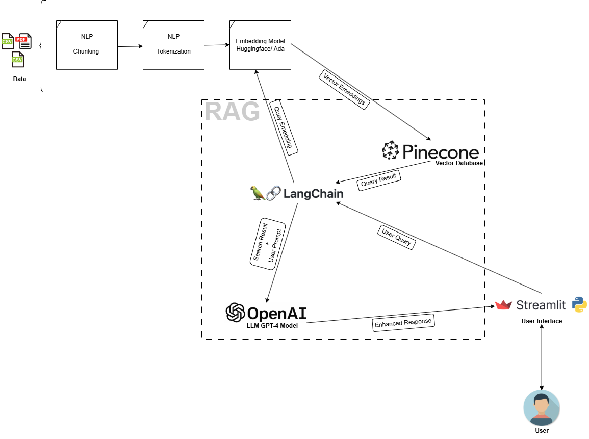

# **University FAQ Chatbot for Bournemouth University with LLM Integration**

## Introduction
Welcome to the repository for the **Bournemouth University Chatbot Project**! This project aims to build a robust, context-based chatbot designed to provide accurate and conversational responses to user queries. Leveraging state-of-the-art natural language processing (NLP) techniques, this chatbot connects large language models (LLMs) to external data sources, ensuring reliable and real-time information retrieval.

---

## **Key Features**

- **Data Collection**: Automates data collection by webscraping information from university websites and extracts useful information from PDF files using `PyPDF2`. The extracted data undergoes cleaning, processing, and transformation for use in the chatbot.
- **LLM Connection**: Uses Langchain to integrate large language models (OpenAI, Gemini) with external data sources for accurate query resolution.
- **Vector Database**: Implements Pinecone for efficient storage and fast retrieval of data, enabling the chatbot to perform accurate and quick searches.
- **Multilingual Support**: Provides responses in multiple languages (e.g., Spanish, Italian) to support diverse user groups.
- **Interactive UI**: Built using Streamlit, the web interface offers an intuitive and user-friendly platform for engaging with the chatbot.
- **Evaluation Metrics**: Ensures robustness with evaluation metrics such as BERT score and other LLM-specific evaluation measures.
- **Deployment**: Deployed using Render for free hosting, with Docker for containerization and potential cloud integration (e.g., Azure).
- **CI/CD**: Utilizes GitHub Actions for continuous integration and delivery, ensuring streamlined collaboration and project updates.
- **Performance Monitoring**: Includes logging mechanisms to track the chatbot's performance and identify areas for improvement.

---

## **Technologies and Tools**

| **Category**                | **Tool/Library**            |
|-----------------------------|-----------------------------|
| **LLM Models**              | OpenAI, Gemini             |
| **Data Processing**         | Pandas, Matplotlib, Plotly |
| **Data Retrieval**          | Langchain                  |
| **Vector Database**         | Pinecone                   |
| **Code Formatting**         | Ruff, Black                |
| **Web Application**         | Streamlit                  |
| **Collaboration**           | GitHub, GitHub Actions     |
| **Deployment**              | Render, Docker, Azure      |
| **Automation (Optional)**   | Airflow                    |

---

## Technical Work

### Architecture Diagram


## **Setup and Installation**

1. Clone the Repository
```bash
git clone https://github.com/username/university-chatbot.git
cd university-chatbot
```

2. Create a Virtual Environment and activate it
```bash
python -m venv venv
source venv/bin/activate # Linux/Mac OS
venv\Scripts\activate # Windows
```

3. Install Dependencies and required packages
```bash
pip install -r requirements.txt 
```
4. Create '.env file and configure Environment Variables (Refer to the .env.example file) for the required configuration settings.

5. Get the API keys for OpenAI, Pinecone, and Render and update the .env file with the respective keys from [Pinecone](https://www.pinecone.io/docs/), [OpenAI](https://beta.openai.com/docs/), and [Render](https://render.com/docs).


6. Run the Chatbot Application
```bash
streamlit run app.py
```

## **Project Workflow**
- **Data Extraction**: Data Extraction: Scrape university websites and extract PDF content.
- **Data Processing**: Transform data using Pandas and store it in a Pinecone vector database for quick retrieval.
- **LLM integration**: Use Langchain to connect the stored data to an LLM for context-aware query resolution.
- **UI Deployment**: Create a user-friendly interface with Streamlit.
- **Evaluation**: Measure the chatbot’s accuracy using metrics like BERT score and other LLM evaluation tools.
- **CI/CD**: Use GitHub Actions for continuous integration and delivery, ensuring streamlined collaboration and project updates.
- **Deployment**: Deploy the chatbot on Render or Docker, with optional CI/CD pipelines using GitHub Actions.
- **Performance Monitoring**: Includes logging mechanisms to track the chatbot's performance and identify areas for improvement.

---

## **Contributing** ###

we welcome contributions from the community! If you're interested in contributing to this project, please follow these steps:
 - Fork the repository
    - Clone the forked repository (`git clone repository`)
    - Create a new branch (`git checkout -b feature/improvement`)
    - Make your changes and commit them (`git commit -am 'Add new feature'`)
    - Push the changes to your branch (`git push origin feature/improvement`)
    - Create a pull request to the main repository with a detailed description of the changes made and the reason for the changes. (`git pull-request`)

---

## **License**
This project is licensed under the MIT License - see the [LICENSE](LICENSE) file for details.

---
## **Contact Information**
For further information or inquiries, please contact the project maintainers:
- (mailto: nengikennwariso@gmail.com)
- LinkedIn: [Tamunonengiyeofori Kenn-Wariso](https://www.linkedin.com/in/tamunonengiyeofori-kenn-wariso-7759b2154/)

---

## **Acknowledgements**
We would like to acknowledge the following resources and references that inspired and guided this project:
- [Streamlit Documentation](https://docs.streamlit.io/en/stable/)
- [Pinecone Documentation](https://www.pinecone.io/docs/)
- [OpenAI API Documentation](https://beta.openai.com/docs/)
- [Langchain Documentation](https://python.langchain.com/docs/introduction/)
- [Render Documentation](https://render.com/docs)
- [Docker Documentation](https://docs.docker.com/)
- [Azure Documentation](https://docs.microsoft.com/en-us/azure/)
- [GitHub Actions Documentation](https://docs.github.com/en/actions)
- [PY2PDF Documentation](https://pypdf2.readthedocs.io/en/3.x/)

---